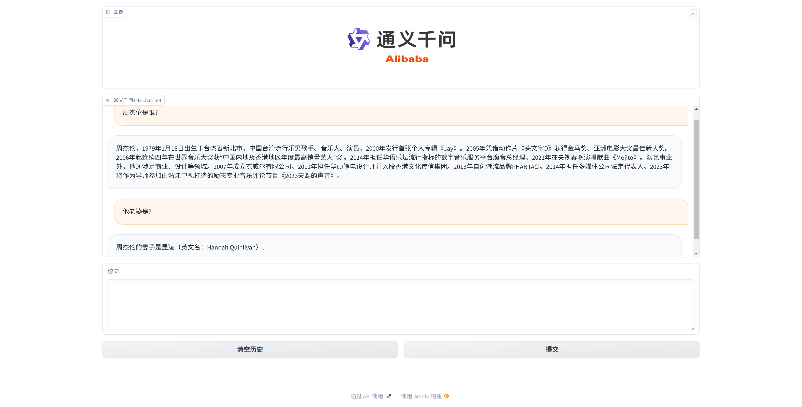

# ASAG

# Deployment

* Offline inference: vllm_wrapper.py referenced from [Qwen official implementation](https://github.com/QwenLM/Qwen/blob/main/examples/vllm_wrapper.py)
* Online inference: vllm_server.py and vllm_client.py referenced from [vLLM official implementation - server](https://github.com/vllm-project/vllm/blob/main/vllm/entrypoints/api_server.py), [vLLM official implementation - client](https://github.com/vllm-project/vllm/blob/main/examples/api_client.py)

# Feature

This project aims to achieve high concurrency automatic short answer grading (ASAG) system and implement the construction of service.

* vLLM supports Continuous batching of incoming requests，using an extra thread for inferencing.
* vLLM provides abstracts of asyncio, using asyncio http framework after abstracts of uvicorn+fastapi to achieve http api privision
* vLLM stream response of next token，providing chunk streaming response based on fastapi.


## Requirements

- python=3.10
- cuda=12.1
- torch=2.1
- tiktoken
- transformers

## Offline inference

```
python vllm_offline.py
Question: Hello.
Hi! How can I help you?
Question: Nothing.
Okay，if you need any help，just contact me!
```

## Online inference


Launch HTTP server:
```
python vllm_server.py -m [index of the model in the following list]
```

Launch HTTP client
```
python vllm_client.py
```

## Supported models

* `Qwen/Qwen1.5-14B-Chat-GPTQ-Int4`
* `Qwen/Qwen1.5-32B-Chat-AWQ`
* `internlm/internlm2-chat-7b`
* `01-ai/Yi-1.5-9B-Chat`
* `modelscope/Yi-1.5-34B-Chat-AWQ`
* `CohereForAI/aya-23-8B`
* `meta-llama/Meta-Llama-3-8B-Instruct`
* `THUDM/glm-4-9b-chat`
* `Qwen/Qwen2-7B-Instruct`

## webui

After launching vllm_server, you can also run gradio_webui.py which is a webui based on gradio. This can achieve a chat-liked format like ChatGPT, which is more user-friendly.

```
python gradio_webui.py
```


